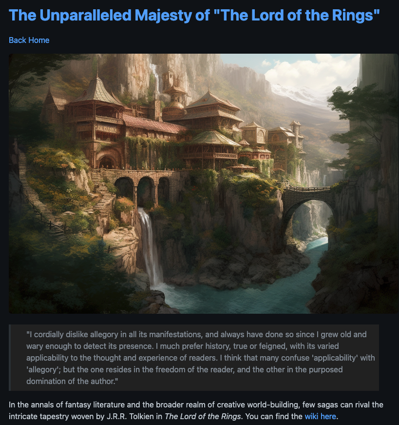

<!--
**Ch40s1/Ch40s1** is a ✨ _special_ ✨ repository because its `README.md` (this file) appears on your GitHub profile.

Here are some ideas to get you started:

- 🔭 I’m currently working on ...
- 🌱 I’m currently learning ...
- 👯 I’m looking to collaborate on ...
- 🤔 I’m looking for help with ...
- 💬 Ask me about ...
- 📫 How to reach me: ...
- 😄 Pronouns: ...
- ⚡ Fun fact: ...
-->
# Hi! My name is Daniel Zarate 😄
========================================================================================================================================

I am a Full-Stack Developer based in Dallas Tx, U.S.
 

### Languages

 
* Most comftarble in: 
 

### Frameworks

 
* Most comftarble in: 

## Check out my work! 💯

## Maze Solver

link ➡️ [maze solver](https://github.com/Ch40s1/maze-solver)

* Tech used:
 

 

## Static Site Generator

link ➡️ [static-site-generator](https://github.com/Ch40s1/static_site_generator)

* Tech used:
 

#### Static Site Generator
[static-site-generator](https://github.com/Ch40s1/static_site_generator)
* Tech used:
 

### Socials

  

